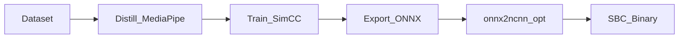

# Finishing the hand-tracking project (your checklist)

This repo implements **10-point** hand tracking (MobileNetV4 + SimCC), with MediaPipe as teacher, PyTorch training, ONNX export, optional NCNN on SBC, and optional PnP. **“Done”** means: a **student model** that generalizes to your camera (not a center blob), exports that meet the **size/latency** targets, and—if you need deployment—a working **NCNN** binary on the Orange Pi (or **TFLite/SNPE** on Android), plus optional **3D/PnP** with real intrinsics.

Use this file as a **progress tracker**. Commands assume the repo root is `~/handtracking` and `PYTHONPATH=.` (or `pip install -e .` once).

---

## Prerequisites

- [ ] **Disk**: room for FreiHAND (or another dataset) and distilled manifests; ONNX/NCNN artifacts are gitignored by default.
- [ ] **Camera**: USB cam works with V4L2 (test with [camera.py](camera.py)); note the correct index if not `0` (`v4l2-ctl --list-devices` when available).
- [ ] **Python**: 3.10+ recommended; GPU optional for training.
- [ ] **Target board** (optional): Orange Pi 5 Max or RK3588 SBC for NCNN latency goals.

---

## One-time setup

- [ ] Create a venv (recommended): `python3 -m venv .venv && source .venv/bin/activate`
- [ ] Install the package: `pip install -e .` **or** `pip install -r requirements.txt`
- [ ] For faster **live student** preview on CPU: `pip install onnxruntime` (also in [requirements.txt](requirements.txt))

---

## Data and distillation (Phase 1)

**Goal:** A large [data/distilled/manifest.jsonl](data/distilled/manifest.jsonl) with 10-point labels in 160² letterbox space, plus [data/distilled/samples.png](data/distilled/samples.png) for a quick visual check.

| Step | Action |
|------|--------|
| Dataset | Download **FreiHAND** (or InterHand2.6M) per the dataset license/host instructions. |
| Distill | `PYTHONPATH=. python3 -m handtracking.distill_freihand --data-root /path/to/freihand --out data/distilled/manifest.jsonl` |
| Verify | `PYTHONPATH=. python3 -m handtracking.verify_samples --manifest data/distilled/manifest.jsonl --out data/distilled/samples.png` |

**Code:** [handtracking/distill_freihand.py](handtracking/distill_freihand.py), [handtracking/verify_samples.py](handtracking/verify_samples.py), topology in [handtracking/topology.py](handtracking/topology.py).

- [ ] Manifest has enough **diverse** frames (not ~10 demo images). The demo images are images of dogs and should not be used for real comparisons.
- [ ] `samples.png` shows plausible 10-point overlays but they're all pictures of dogs paws.

---

## Training (Phase 3 loop)

**Goal:** A checkpoint that **does not** collapse all joints to the letterbox center when run live.

| Step | Action |
|------|--------|
| Train | `PYTHONPATH=. python3 -m handtracking.train --manifest data/distilled/manifest.jsonl --epochs … --batch-size … --out checkpoints/hand_simcc.pt` |
| QAT (optional) | `… --qat --qat-epochs …` — FP32 weights for ONNX are saved as `checkpoints/hand_simcc.fp32.pt` before convert ([handtracking/train.py](handtracking/train.py)). |

**Code:** [handtracking/train.py](handtracking/train.py), dataset [handtracking/dataset.py](handtracking/dataset.py), loss [handtracking/losses.py](handtracking/losses.py).

- [ ] Loss decreases over epochs on your full manifest.
- [ ] **Live check:** [handtracking/live_camera.py](handtracking/live_camera.py) `--source student` should show a **spread** skeleton after real training (not one dot)—use `--source teacher` to validate the camera while training catches up.

---

## Export and size gate (Phase 3)

**Goal:** Fixed ONNX `[1, 3, 160, 160]`, then NCNN **&lt; 5 MB** total (param + bin) after optimize when possible.

| Step | Action |
|------|--------|
| ONNX | `PYTHONPATH=. python3 -m handtracking.export_onnx --checkpoint checkpoints/hand_simcc.pt --out models/hand_simcc.onnx` |
| Size check | `PYTHONPATH=. python3 -m handtracking.phase3_verify` |
| NCNN | With `onnx2ncnn` and `ncnnoptimize` on `PATH`: `./scripts/convert_ncnn.sh models/hand_simcc.onnx models/ncnn` |

**Code:** [handtracking/export_onnx.py](handtracking/export_onnx.py), [handtracking/phase3_verify.py](handtracking/phase3_verify.py), [scripts/convert_ncnn.sh](scripts/convert_ncnn.sh).

- [ ] ONNX exports from **FP32** checkpoint (not QAT-converted weights) for a smooth path ([handtracking/export_onnx.py](handtracking/export_onnx.py)).
- [ ] If NCNN tools are missing on the host, install/build **NCNN** and add `onnx2ncnn` / `ncnnoptimize` to `PATH`.

---

## SBC / Orange Pi (Phase 4)

**Goal:** NCNN built with **OpenMP**, C++ demo runs camera + letterbox + inference + 1€ filter; log **`inference_time_ms`** toward **&lt; 4 ms** on Pi 5–class hardware (model-dependent).

| Step | Action |
|------|--------|
| Build NCNN | Build NCNN with `WITH_OPENMP=ON`; install CMake package or set `ncnn_DIR` / `NCNN_ROOT`. |
| Build demo | `cd cpp/build && cmake .. -Dncnn_DIR=/path/to/lib/cmake/ncnn && cmake --build .` |
| Model | Place optimized `.param` / `.bin` where [cpp/main.cpp](cpp/main.cpp) expects (defaults under `models/ncnn/`). |
| Run | `./hand_ncnn_demo 0 ../models/ncnn/hand_simcc.opt.param ../models/ncnn/hand_simcc.opt.bin 200` |

**Code:** [cpp/CMakeLists.txt](cpp/CMakeLists.txt), [cpp/main.cpp](cpp/main.cpp), [cpp/OneEuroFilter.hpp](cpp/OneEuroFilter.hpp).

- [ ] After `onnx2ncnn`, **blob names** in the `.param` may differ from `input`, `simcc_x`, `simcc_y`—edit [cpp/main.cpp](cpp/main.cpp) or re-export names to match.
- [ ] Target **90 FPS** capture may require a sensor mode your hardware actually supports.

---

## Android (optional)

**Goal:** Deploy `.tflite` or SNPE `.dlc` per your vendor toolchain.

| Step | Action |
|------|--------|
| Starter | [scripts/onnx_to_tflite.sh](scripts/onnx_to_tflite.sh) is a placeholder; use TensorFlow Lite converter or **ai-edge-torch** / SNPE docs for your NPU. |

- [ ] Representative dataset for full INT8 if required by the converter.

---

## Live Python demo (debugging)

| Mode | Command | Expectation |
|------|---------|-------------|
| Teacher (reliable 2D) | `PYTHONPATH=. python3 -m handtracking.live_camera --source teacher` | Landmarks follow the hand; ~camera-limited FPS. |
| Student (your weights) | `PYTHONPATH=. python3 -m handtracking.live_camera --source student --backend onnx --infer-every 8` | Faster than raw PyTorch on CPU; needs **trained** weights to look good. |
| Raw camera only | `python3 camera.py` | Confirms V4L2 + resolution without ML. |

**Code:** [handtracking/live_camera.py](handtracking/live_camera.py), [camera.py](camera.py), NumPy decode [handtracking/simcc_numpy.py](handtracking/simcc_numpy.py).

---

## 3D / PnP (optional, Phase 5)

**Goal:** Palm normal, `solvePnP` with wrist + 4 MCPs, splay/curl style angles—using **real intrinsics** for serious use.

| Step | Action |
|------|--------|
| Demo | `PYTHONPATH=. python3 -m handtracking.pnp_kinematics --demo` |

**Code:** [handtracking/pnp_kinematics.py](handtracking/pnp_kinematics.py)

- [ ] Replace demo intrinsics with **calibrated** `K` and distortion for your camera.

---

## End-to-end flow (reference)

---

## “Runs well” success criteria (from the mission)

- [ ] **Phase 1:** `samples.png` with 10 sensible overlays from distilled data.
- [ ] **Phase 2:** [handtracking/verify_forward.py](handtracking/verify_forward.py) shows SimCC branches `(1, 11, 320)`.
- [ ] **Phase 3:** NCNN optimized artifacts **under ~5 MB** combined (or justify width/depth change); ONNX alone is a fallback check in [handtracking/phase3_verify.py](handtracking/phase3_verify.py).
- [ ] **Phase 4:** Logged **`inference_time_ms`** on target toward **&lt; 4 ms** (RK3588-class; depends on model width).
- [ ] **Phase 5:** PnP / normal / angles verified in log or minimal viz.
- [ ] **Student live:** skeleton **covers the hand** (not a single center blob)—requires **sufficient training data and epochs**.

---

## Troubleshooting

| Symptom | What to do |
|---------|----------------|
| `ModuleNotFoundError: handtracking` | Run from repo root with `PYTHONPATH=.` or `pip install -e .` |
| `bash\r` running shell scripts | Scripts must be LF-only; see [.gitattributes](.gitattributes); `sed -i 's/\r$//' scripts/*.sh` |
| Student = green blob in center | Toy checkpoint / tiny data; train on FreiHAND-scale data; use `--source teacher` meanwhile |
| Low FPS student | Use `--backend onnx` + `onnxruntime`; increase `--infer-every`; deploy NCNN on device |
| Wrong camera | Try `--camera 1`, `2`, … |
| NCNN load / extract fails | Check blob names in `.param` vs [cpp/main.cpp](cpp/main.cpp) |
| QAT ONNX export errors | Export FP32 `hand_simcc.fp32.pt` from QAT run, or skip QAT until export path is validated |

---

## Master checkbox list

- [ ] Prerequisites met (disk, camera, Python)
- [ ] `pip install -e .` or equivalent
- [ ] FreiHAND (or other) downloaded and distilled; `samples.png` OK
- [ ] Trained checkpoint (not demo-scale only); live student looks plausible
- [ ] ONNX exported; `phase3_verify` OK
- [ ] `onnx2ncnn` + `ncnnoptimize`; files copied to device
- [ ] NCNN + OpenMP built; `hand_ncnn_demo` runs; latency logged
- [ ] (Optional) Android package built
- [ ] (Optional) PnP with real intrinsics
- [ ] Mission criteria above satisfied on target hardware

---

*Aligned with [task_1.txt](task_1.txt).*
